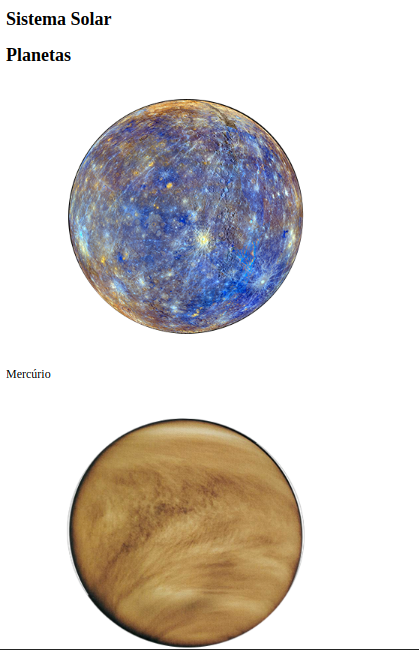

# Boas vindas ao repositório do projeto Solar-System!

esse projeto é um projeto que usei para aprendizado de react e utiliza os conceitos básicos de React: componentes, props e composição de componentes.

É uma aplicação em React com criação de componentes de classe e passagem de props. Essa aplicação simulará uma visualização do Sistema Solar, bem como informações sobre diversas missões espacias que ocorreram ao longo da história.

Esta aplicação foi construida com React e abre na porta 3000 no endereço http://localhost:3000/, as informações são salvas no local storage do seu browser, sendo apagadas quando fecha o seu browser de navegação.

# ‼️ instalando este projeto !!

  1. Clone o repositório
  - entre na pasta que deseja instalar e abra o terminal.
  - Use o comando: `git clone git@github.com:th-maia/solar-system.git`.
  - Entre na pasta do repositório que você acabou de clonar:
    - `cd solar-system`

  2. Instale as dependências

  - Para isso, use o seguinte comando: `npm install`, espere alguns segundos.
      caso dê algum erro tente rodar novamente o comando acima, pode ocorrer por diferentes versões ou pacotes que foram instalados após outros.
  
  3. rode o comando para iniciar a aplicação: `npm start`
      este comando demora alguns segundos, se tudo der certo irá aparecer a pagina web. 

# Sobre este projeto:

- Utiliza JSX no React

- Utiliza corretamente o método render() para renderizar seus componentes

- Utiliza import para trazer componentes em diferentes arquivos

- Cria componentes de classe em React

- Cria múltiplos componentes a partir de um array

- Faz uso de props corretamente

- Faz uso de PropTypes para validar as props de um componente